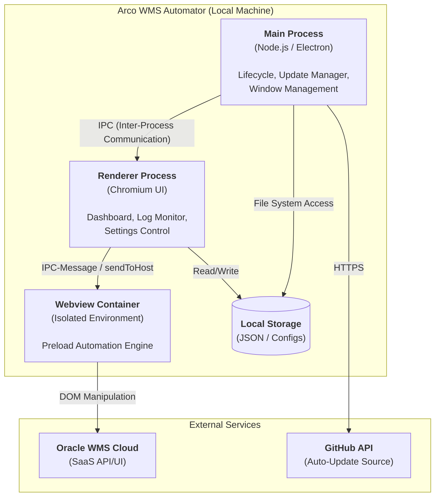
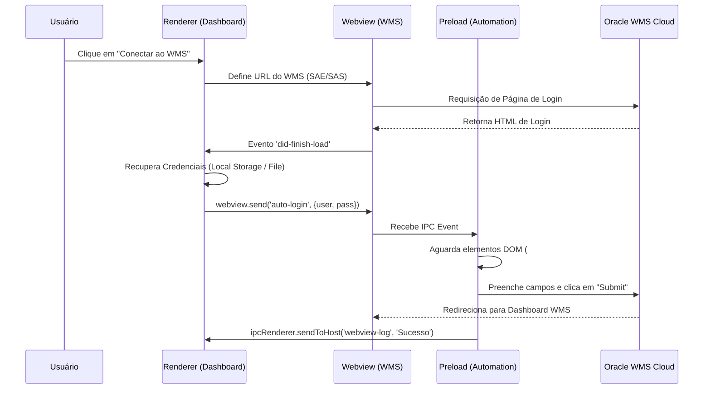

# Documentação de Arquitetura: Arco WMS Automator

Esta documentação detalha a arquitetura de software, o fluxo de dados e as diretrizes de segurança do sistema **Arco WMS Automator**, desenvolvida para o setor de TI e Segurança da Informação.

## 1. Visão Geral do Sistema

O **Arco WMS Automator** é uma aplicação desktop baseada em Electron projetada para automatizar processos repetitivos dentro do sistema de gerenciamento de armazém (WMS) da Oracle Cloud. A aplicação atua como uma camada de automação robótica de processos (RPA), interagindo com o WMS de forma controlada e segura.

## 2. Mapeamento da Estrutura

A aplicação segue a arquitetura padrão do Electron, dividida entre o processo principal e os processos de renderização, com uma camada adicional de isolamento para a interface do WMS.

| Componente | Tecnologia | Responsabilidade |
| :--- | :--- | :--- |
| **Main Process** | Node.js (Electron) | Gerenciamento de ciclo de vida do app, criação de janelas, gerenciamento de atualizações e comunicação com o SO. |
| **Renderer Process (UI)** | HTML5, CSS3, JavaScript | Interface do usuário (Dashboard), gerenciamento de logs locais, persistência de credenciais e controle das automações. |
| **Webview Container** | Electron Webview | Ambiente isolado que carrega o Oracle WMS (SaaS). Atua como um "sandbox" para o ambiente externo. |
| **Preload Script** | JavaScript | Ponte de comunicação e motor de automação injetado no Webview. Executa manipulação de DOM e dispara eventos de teclado/mouse. |
| **Armazenamento Local** | JSON / LocalStorage | Armazenamento de credenciais em arquivo local (`arco-wms-creds.json`) e configurações de preferência. |

---

## 3. Diagrama de Arquitetura (C4 - Nível de Container)

O diagrama abaixo ilustra a segregação de responsabilidades e as fronteiras de comunicação entre os componentes internos e serviços externos.

---

## 4. Fluxo de Dados: Processo de Login Automático

O fluxo de dados abaixo descreve a sequência de operações desde a entrada das credenciais até a autenticação bem-sucedida no sistema Oracle.

---

## 5. Práticas de Segurança e Conformidade

Para garantir a conformidade com as políticas de TI e Segurança, o projeto implementa as seguintes camadas de proteção:

### 5.1. Isolamento de Contexto via Webview
A interação com o Oracle WMS ocorre dentro de um componente `<webview>` com isolamento de contexto. Isso impede que scripts maliciosos ou vulnerabilidades do site externo acessem o sistema de arquivos local ou as APIs de baixo nível do Node.js.

### 5.2. Preload Scripts (Sandboxing)
A lógica de automação é injetada via `preload.js`, o que permite a manipulação do DOM de forma segura e controlada, sem expor o objeto `global` da aplicação principal ao conteúdo web externo.

### 5.3. Comunicação IPC Sanitizada
A comunicação entre o Dashboard e o Motor de Automação é feita exclusivamente via mensagens IPC (`sendToHost` e `ipc-message`). Não há execução de código arbitrário (`eval`) ou exposição de objetos de sistema.

### 5.4. Persistência Local de Dados
As credenciais são armazenadas no diretório de perfil do usuário (`arco-wms-creds.json`), seguindo o princípio de menor privilégio. A aplicação não transmite dados sensíveis para servidores externos, exceto para o destino oficial do Oracle WMS via HTTPS.

---

## 6. Escalabilidade e Manutenção

O sistema foi desenhado de forma modular:
- **Novas Rotinas**: Podem ser adicionadas ao `preload.js` de forma independente.
- **Multi-ambiente**: Alternância rápida entre Produção (SAE) e Teste (SAS).
- **Auto-Update**: Ciclo de vida de atualização automatizado via GitHub para deploy contínuo de patches de segurança.

---
**Documento emitido por:** Arquitetura de Software - Arco Educação
**Status:** Oficial / Revisado
